# Pleco-to-Anki

An [Anki](https://ankiweb.net/shared/info/427686509) add-on for importing [Pleco](https://www.pleco.com) bookmarks, enhancing the integration of two essential tools for learning Chinese.

It streamlines flashcard creation by automatically transferring character info, pinyin, definitions, and examples from Pleco bookmarks to Anki cards, with improved formatting.

Optionally, it includes context-rich example sentences from [Spoonfed Chinese](https://promagma.gumroad.com/l/IEmpwF) for enhanced pronunciation practice.


# Quick Guide

1. Install the add-on through [AnkiWeb](https://ankiweb.net/shared/info/427686509) using the code `427686509`, or download the latest release from the [Releases page](https://github.com/vonpetersenn/Pleco-to-Anki/releases) and double-click the `.ankiaddon` file.
2. Export Pleco bookmarks on your phone and save them on your computer. Make sure to use these [settings](README_media/img_4.png).
3. Import the bookmarks in Anki under `Tools -> Import Pleco Bookmarks`.
4. Reformat the cards to your liking.

# Table of Contents

- [Quick Guide](#quick-guide)
- Table of Contents
- Documentation
  - [1. What this tool does](#1-what-this-tool-does)
    - [1.1 Example of a card being imported from Pleco to Anki](#11-example-of-a-card-being-imported-from-pleco-to-anki)
  - [2. Installation](#2-installation)
  - [3. Usage](#3-usage)
    - [3.1 Export Pleco Bookmarks in the Pleco app](#31-export-pleco-bookmarks-in-the-pleco-app)
    - [3.2 Import Pleco Bookmarks into Anki](#32-import-pleco-bookmarks-into-anki-using-this-addon)
    - [3.3 Reformat the cards to your liking](#33-reformat-the-cards-to-your-liking)
  - [4. Features](#4-features)
    - [4.1 Sort information into fields](#41-sort-information-into-fields)
    - [4.2 Format information](#42-format-information)
    - [4.3 Add Spoonfed sentences](#43-add-spoonfed-sentences)
- [Contributing](#contributing)


# Documentation

## 1. What this tool does

The Pleco app allows users to store bookmarks and export them to a text file. This tool parses the text file and imports the bookmarks into Anki. The bookmarks are sorted into corresponding fields, such as the Chinese characters, pinyin, definition, and example sentences.

After importing, one only has to give the cards a final touch to one's liking, for example by deleting redundant information, adding pictures, or changing the note type.

Since the information stored in Pleco bookmarks is not well structured, this tool does not work perfectly: sometimes the formatting will be off or content sorted into the wrong field. However, it still speeds up the process of building high-quality Anki cards, since it automates most of the work and adds HTML formatting to the notes.

Additionally, this add-on can include example sentences from [Spoonfed Chinese](https://promagma.gumroad.com/l/IEmpwF). It finds sentences from the Spoonfed deck that contain the word at hand and adds them to the card. Since the Spoonfed decks contain thousands of sentences with audio from native speakers, this is a great way to practice pronunciation in context. The Spoonfed deck needs to be loaded in your Anki collection for this feature to work.

### 1.1. Example of a card being imported from Pleco to Anki

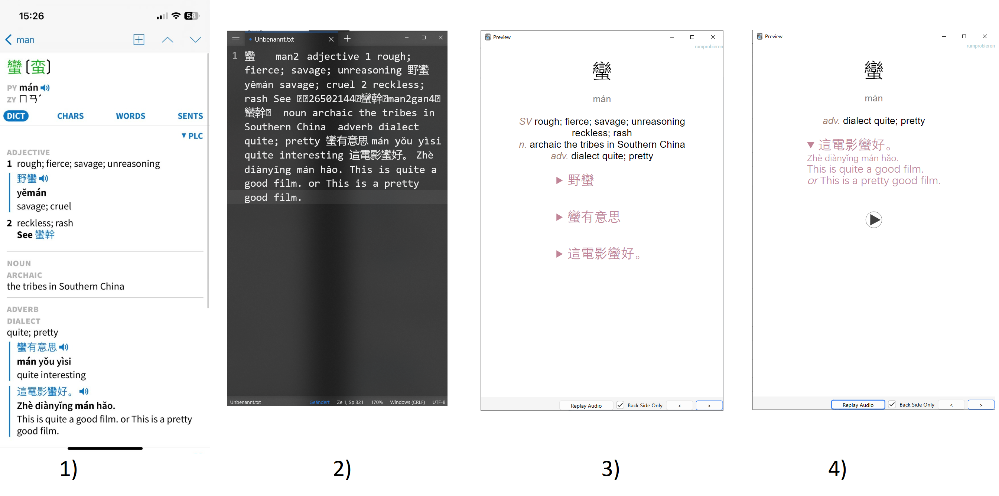

1. Bookmark in Pleco
2. Raw data after exporting the Pleco bookmarks
3. Card after importing into Anki using this tool
4. Card after manual editing in Anki

## 2. Installation

Three options:

1. **AnkiWeb (recommended):** In Anki go to `Tools -> AddOns -> Get AddOns` and enter code `427686509`. [View on AnkiWeb](https://ankiweb.net/shared/info/427686509).
2. **GitHub Release:** Download the latest `.ankiaddon` file from the [Releases page](https://github.com/vonpetersenn/Pleco-to-Anki/releases) and install by double-clicking or via `Tools -> AddOns -> Install from file`.
3. **From source:** See the [Contributing](#contributing) section.

If you want to use the Spoonfed Chinese feature, you need to have the Spoonfed Chinese deck loaded in your Anki collection. The deck can be purchased at [Spoonfed Chinese](https://promagma.gumroad.com/l/IEmpwF).

## 3. Usage

### 3.1. Export Pleco Bookmarks in the Pleco app

1. In the Pleco app go to `Import / Export` -> `Export Bookmarks`.

2. Make sure to match the `File Format` and `Include Data` options from the screenshot below. For `Character Set`, choose `traditional` or `simplified`.

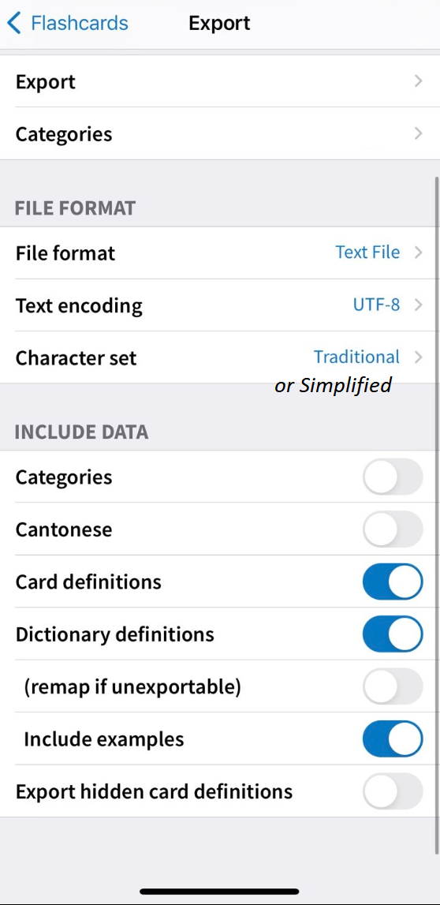

Then tap `Begin Export`.

3. Go to the file manager and send the file to your computer, e.g. via AirDrop, email, or a messenger app.

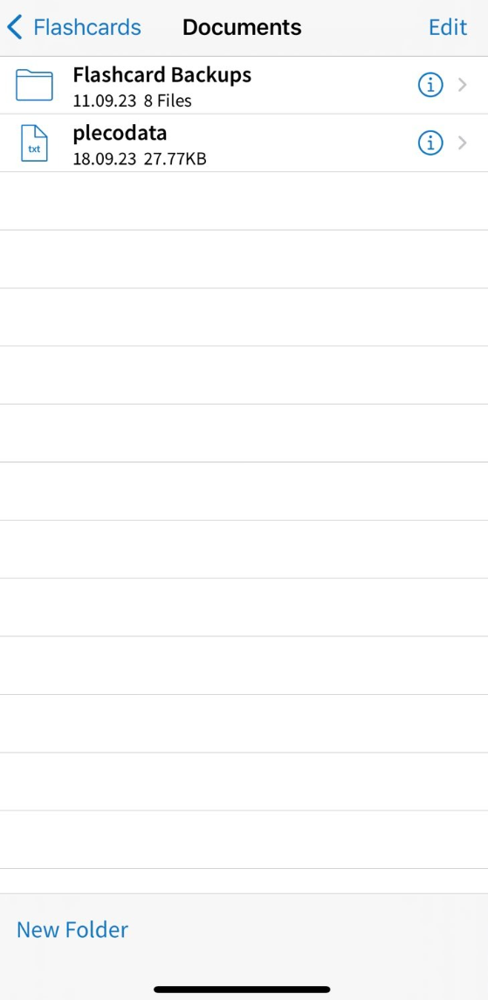

### 3.2. Import Pleco Bookmarks into Anki using this AddOn

In Anki go to `Tools -> Import Pleco Bookmarks`. Select the file you exported from Pleco and click `Ok`. The options are set to sensible defaults and toggle the features described below.

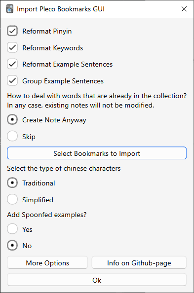

### 3.3. Reformat the cards to your liking

Example of a card after importing. In red: example sentences from Pleco. In green: example sentences from Spoonfed Chinese.

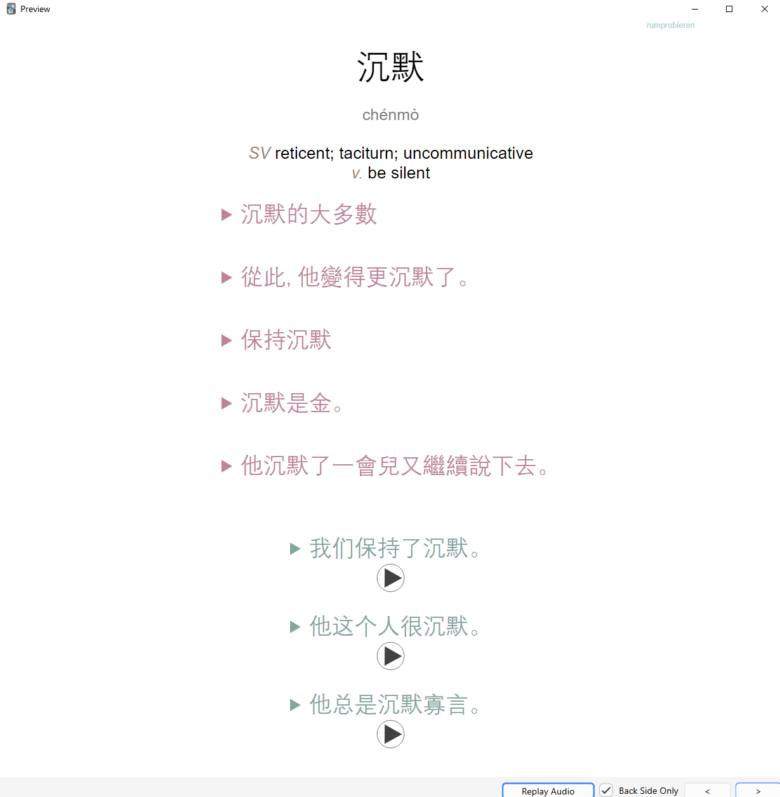

View of the note while editing in Anki. Either edit in the standard view or click the button to the top right of each field to edit the HTML directly.

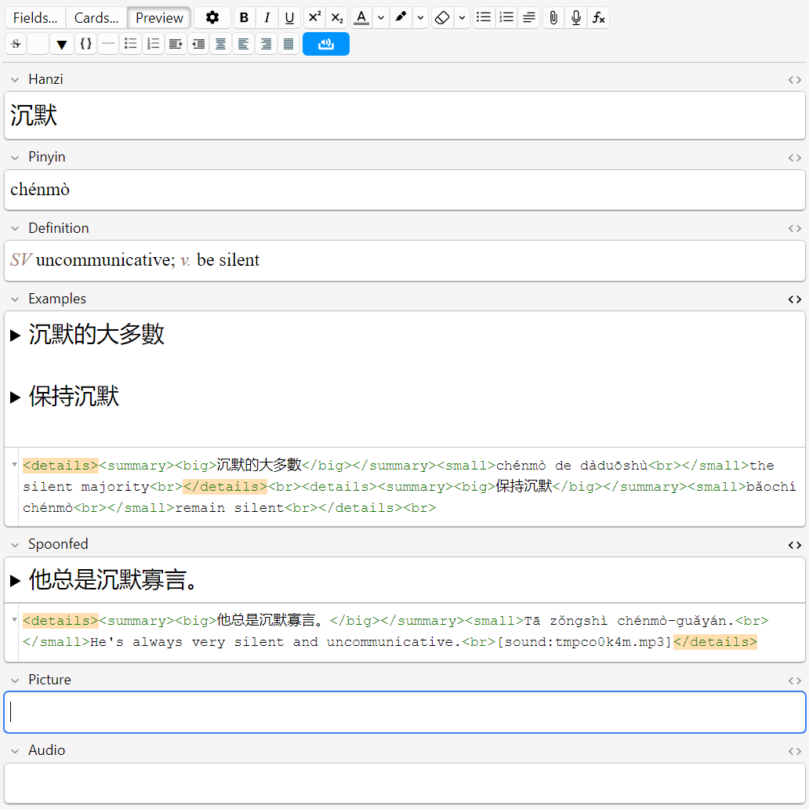

Same card after manual editing.

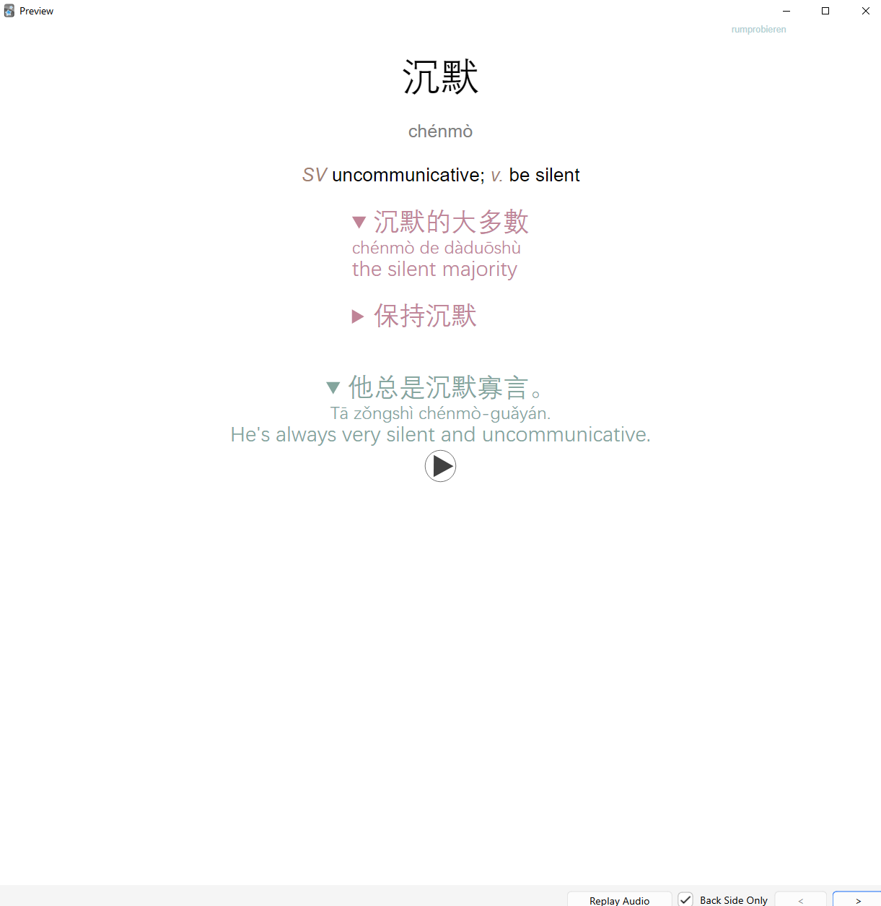

## 4. Features

### 4.1. Sort information into fields

The definition and examples in Pleco bookmarks are not separated in any way. This tool tries to identify example sentences and sort them into a separate field.

For example, the definition of `中國` in Pleco is:

> `China 中國大陸 zhōngguó dàlù Chinese mainland; mainland of China ....`

This gets split into two fields:
- **Definition:** `China`
- **Examples:** `中國大陸 zhōngguó dàlù Chinese mainland; mainland of China ....`

This also works for words with multiple definitions and examples.

The tool creates notes with the fields `Hanzi`, `Pinyin`, `Definition`, `Examples` (and `Spoonfed` if enabled).

### 4.2. Format information

#### Prettier Pinyin

Pleco bookmarks contain numerical pinyin (e.g. `ni3 hao3`). This tool converts it to pinyin with tone marks (e.g. `nǐ hǎo`), using a custom fork of the open-source [tones](https://github.com/em-shea/tones) repository.

#### Reformatting example sentences

HTML tags are added to example sentences to make them look nicer in Anki. Most importantly, the pinyin and translation are hidden behind the Chinese characters and only shown when clicking on them. This makes it easier to practice reading without relying on the pinyin and translation too much.

For example, the example sentence `中國大陸 zhōngguó dàlù Chinese mainland; mainland of China` of the word `中國` will look like this after importing:

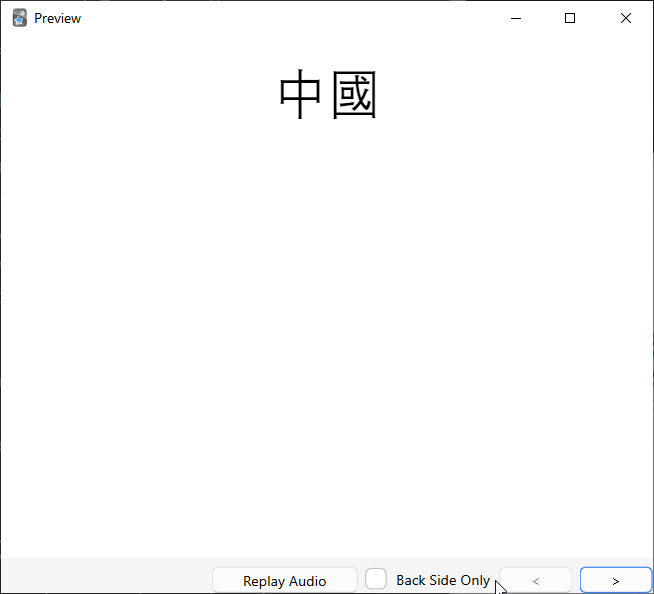

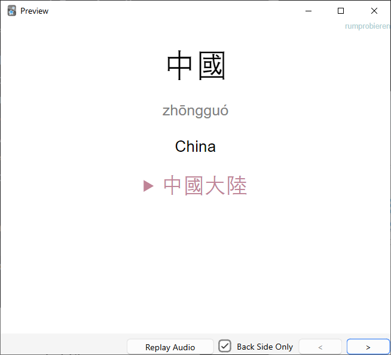

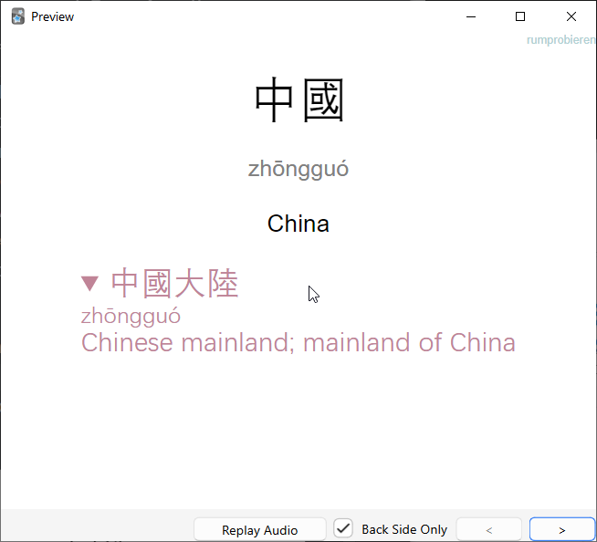

#### Reformat Keywords

Pleco notes can contain keywords such as `verb`, `idiom`, `(TW)` etc. This tool reformats them into styled HTML for improved readability.

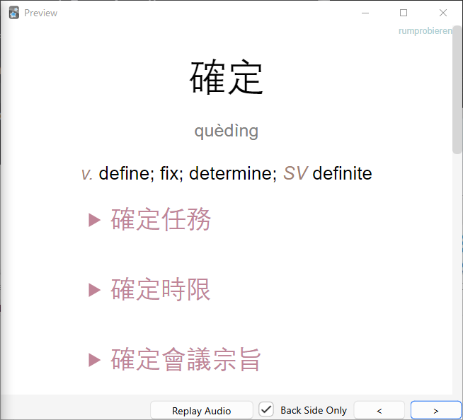

For example, the keywords `verb` and `adjective` are replaced by *v.* and *SV*.

The keyword replacements can be customised by editing `pleco_to_anki/pleco/keyword_replacements.py`.

### 4.3. Add Spoonfed sentences

If you have the [Spoonfed Chinese](https://promagma.gumroad.com/l/IEmpwF) deck loaded in your Anki collection, this tool can add example sentences from it to your cards. It adds up to 3 sentences containing the word at hand. The idea is to choose the sentence that best fits the desired difficulty level and delete the others. Both traditional and simplified characters are supported.

In this example, 3 sentences contain the character 藏, but the first and third actually contain the compound word 收藏 rather than the single-character verb 藏. So the first and third sentences can be deleted, keeping only the most relevant one.

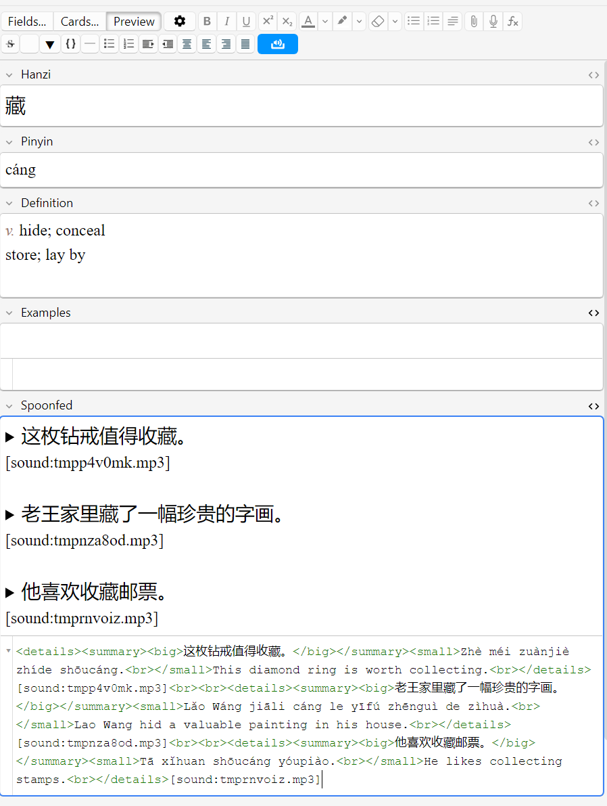

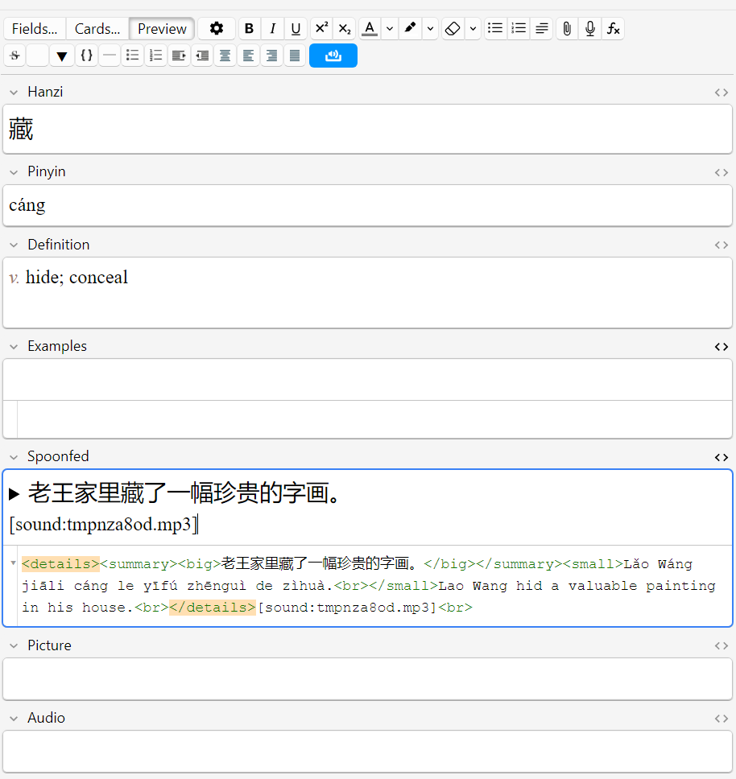

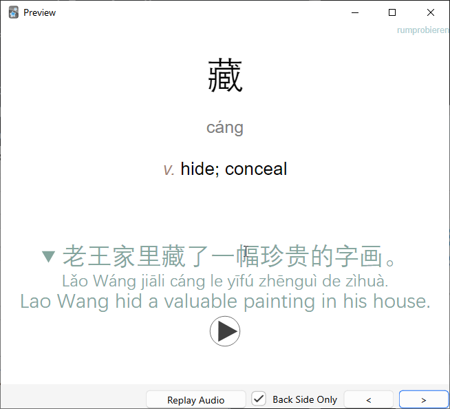

# Contributing

If you find a bug or have a feature request, feel free to open an issue or submit a pull request directly.

If you find a word that should import correctly but doesn't, add it to one of the existing example data files in `pleco_to_anki/` (e.g. `exampledata.txt`) or create a new one from your Pleco export. A **good bug report includes the problematic entry as example data**.

## Development setup

(You might want to first uninstall the Pleco-to-Anki add-on in Anki before starting development and make a backup of your collection.)

Copy or symlink the `pleco_to_anki/` folder into Anki's addons directory and restart Anki to load your changes.

**Copy (simple):**
```bash
cp -r pleco_to_anki ~/Library/Application\ Support/Anki2/addons21/pleco_to_anki
```
Repeat after every change and restart Anki.

**Symlink (recommended):** lets you edit the source directly without copying.
```bash
ln -s /path/to/Pleco-to-Anki/pleco_to_anki ~/Library/Application\ Support/Anki2/addons21/pleco_to_anki
```
Only needs to be done once. Anki must still be restarted after each change.

On Windows the addons folder is typically at `%APPDATA%\Anki2\addons21`.

## Packaging

To build the `.ankiaddon` file:
```bash
cd pleco_to_anki && zip -r "../pleco to anki vX.X.X.ankiaddon" . && cd ..
```

The packaged file is uploaded as a release asset on GitHub. `.ankiaddon` files are not tracked in the repository.
